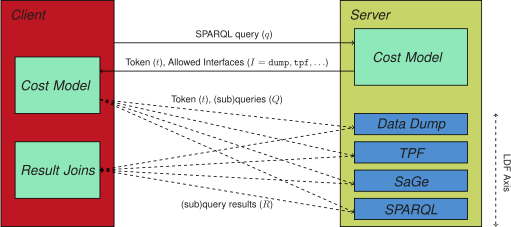

## Hybrid Framework
{:#solution}

The goal of our framework
is to expose different server interfaces
based on the server load and the queries.
Instead of exposing *just one interface* per query,
we expose a *collection of interfaces* per query.
This allows clients to select a combination of interfaces
based on their capabilities, query plans, and other circumstances.

<figure id="figure-solution">

<figcaption markdown="block">
Overview of client-server communication for a cost-model-based query execution over a hybrid of Linked Data Fragments interfaces.
</figcaption>
</figure>

To achieve such a server interface hybrid,
a server cost model selects a set of interfaces based on a given query and the server current load. While a client cost model determines a query plan based on the granted interfaces. [](#figure-solution) shows an overview of this framework
where client-side query engines start by sending a query `q` to the server,
and receive an answer that contains a token `t` and a set of allowed interfaces `I`.
Based on the returned interfaces,
the client can determine a query plan over these interfaces.
These (sub)queries can then be resolved by requesting the appropriate interfaces using the given token.

### Server Component

The server component of our framework consists of
a cost model for calculating a set of allowed interfaces,
and a token-based wrapper over a set of interfaces.

#### Cost Model

The goal of this server-side cost model is to ensure the server availability,
and to allow queries to be executed as fast as possible.
Since the latter goal can sometimes be detrimental to the server availability,
for example when many concurrent users are sending highly complex queries,
availability must always have priority.

Based on these goals, the model should be able to make a suggestion for a set of interfaces
based on a given query and a set of internal metrics.
For this, we propose a set of internal metrics such as the current CPU usage, memory usage and network I/O.
The server administrator must be able to configure a threshold for these metrics,
so that the cost model can select interfaces that optimize both goals.

[](#algorithm-get-allowed-interfaces) shows the pseudocode of an algorithm
that can be used to calculate a set of allowed interfaces.
In this algorithm, `GetValueIncrease` would still need a concrete implementation.
For this, different possibilities exist,
such as heuristics to predict query execution effort based on the number of triple patterns and query operators.
<!--For each incoming query `q`,
the algorithm iterates over all available interfaces, and all metrics.
For each metric, the expected metric value increase is calculated
for the given query using `CalculateMetricIncrease(q, metric)`.
If when adding this value to the current metric's value does not exceed the maximum allowed metric value,
then the loop continues.
If all metrics pass for a given interface,
then an interface is considered an *allowed interface*.-->

<figure id="algorithm-get-allowed-interfaces" class="listing">
````/code/get-allowed-interfaces.txt````
<figcaption markdown="block">
Algorithm for calculating the allowed interfaces for a given query.
</figcaption>
</figure>

<!--Based on our algorithm, the `CalculateMetricIncrease` still needs a concrete implementation.
For this, different possibilities exist.
For instance, heuristics for query complexity can be used to estimate metric value increases,
such as query string length, the depth of the basic graph patterns or the used query operators.
Furthermore, other implementations may be based on query log analysis,
where models could be based on machine learning techniques.-->

#### Interface Wrapper

Based on the server-side cost model,
the server can wrap over a number of LDF interfaces
that the publisher wants to expose.
This wrapper is a proxy that accepts SPARQL queries,
and replies with a token and a set of granted interfaces
that have been calculated for the given query using the server-side cost model.
The token is *required* for performing any requests to any of the wrapped LDF interfaces.

This token should be seen as temporary *permission*
to make use of a specific set of query capabilities from the data publisher.
As such, it has an expiration time.
It is important that the server validates this token upon every request to an LDF interface.
If the server would not do this,
a client could simply ignore the set of allowed interfaces,
and always execute queries against the most expressive interface (e.g. SPARQL endpoint),
even if this interface was not allowed by the server.

<!--Optionally, the server could keep track of token usages
to check whether or not the client does indeed use it
to execute the query it got permission for, and nothing more.
Since keeping track of this token usage could require significant server effort,
simpler heuristics could be used,
such as limiting the temporal validity of a token to the estimated execution time.-->

<!--An optional enhancement of the server could be to directly
reply with a SPARQL query response
if the only allowed server was a SPARQL endpoint,
because the client will be likely to make such a subsequent request.-->

### Client Component

Usually, the goal of clients is to execute queries as fast as possible.
There could however be a number of metrics that can soften this need for fast query execution
such as reducing CPU, bandwidth usage or [optimizing for early results](cite:cites diefficiency).

Using our server-side hybrid of LDF interfaces, clients will retrieve a set of allowed interfaces based on a given query.
With respect to the client resources, the client should determine an efficient query plan based on the granted interfaces capabilities.
While most client-side query algorithms focus on decomposing queries for execution against a single type of interface,
additional algorithms are needed for [*intelligently combining interfaces* for certain subqueries](cite:cites hetero).

Next to these main metrics, others may also influence selection,
<!--For example, if the client will execute *many* queries against the same dataset,
then it can become more efficient to download the full dataset dump.-->
such as the availability of dataset fragments, [locally](cite:cites smartKG) or [within a network of peers](cite:cites webp2p).
